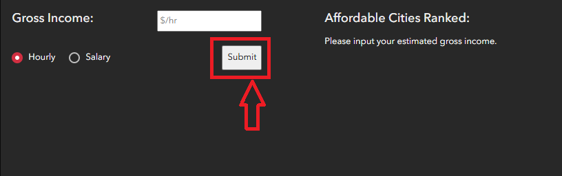

# MetroWage

A Desktop/Laptop-oriented Web Application

## Team SolutionsForUs

- Gustavo Schiele
- Benjamin Schoening
- Vincent Liu

## Mission Statement

In the spring of 2024, 45% of Canadian households, with children, reported that rising prices have significantly impacted their ability to afford daily expenses, which is 12% higher than what was reported two years prior [1]. In fact, this issue dissolves from the federal level, to the metropolitan level. According to the Metro Vancouver Regional District, 45% of renters in Metro Vancouver pay more than 30% of their income towards housing, classifying it as unaffordable for nearly half of the renting population [2].

To put the issue of affordability into perspective, our team drew inspiration from Metro Vancouver’s “living wage”, a metric defined by Living Wage BC as the “the hourly amount that an adult needs to cover basic expenses” for a two-adult, two-child family household [3]. In 2015, the living wage of Metro Vancouver was $20.68 per hour for a family household [4]. However, in 2024, the living wage of Metro Vancouver is now $27.05, increasing by over 30% since 2015 [5]. Living costs of Metro Vancouver increase year by year, with many left worried about being able to afford rising costs. In fact, 1 in 3 workers do not make the hourly living wage of B.C [6]. Thus, we have decided to build an app to help people gain a specified understanding of the costs of living associated with each city in the metropolitan area, and how they compare.

However, the existing living wage metric of Metro Vancouver overlooks the diversity of household types, the diversity of living expenses (across the metropolitan area), and the geographic significance and representation of each distinct region. Thus, our tool modifies the approach of calculating living wage, by expanding beyond the traditional 'two-adult, two-children' household model to include six distinct household types, by accounting for the different modalities of transportation that users may prefer to take, and by disaggregating the single metropolitan living wage into tailored representations for each municipality across Metro Vancouver. This geovisualization bridges the gap between families and individuals who are looking to live/ rent all across the Metropolitan area of Vancouver and their understanding of the different costs of each region.

## Characteristics of the App

- **Interactive**: Allows users to interact with widgets for an enhanced understanding of the provided living wage information.
- **Visually enhanced**: Rather than viewing the living wage information as a plain list, you can view the information through a geographic lens, paired with compelling, toggleable visualizations.
- **Insightful**: Provides information towards the ideal city for each person’s living needs.
- **Personalized**: The app’s “calculator” tailors the user experience to reflect the user’s financial situation for an enhanced context of the living wage information.
- **Family-oriented**: Focuses towards the growth and habitation of families in metro vancouver, visualizing their most affordable and suitable options with additional features to count for such expenses
- **Sustainable**: Incorporates transportation choices—public transit or personal vehicle—into living cost calculations, highlighting potential savings and promoting eco-friendly alternatives.

## Methodology and Justifications

**Redefining the Living Wage**

The living wage metric of the app was inspired by MIT’s Living Wage Calculator. The metric is based on a 40 hour work week for the whole year (52 weeks). Our living wage calculations contain the following factors:
Median monthly rent cost, dependent on household type and city
Average monthly cost of transportation in Metro Vancouver, dependent on method of transportation (public, personal vehicle)
Average cost of child care in Metro Vancouver (if the household has children)
Average monthly cost of utilities in BC, taken as an average of all utilities.
Average monthly cost of groceries per adult in Metro Vancouver (assuming a 2100 daily caloric intake)
Average monthly cost of household items and personal hygiene in Metro Vancouver
Average monthly cost of internet and phone plans in BC
Flat monthly cost of $100

**Calculating the Living Wage**

The living wage calculation can then be formalised into an equation to represent the monthly costs associated with each city, household type, and transportation method:

Where “L” is a living wage function of “h” (household type), “c” (city), and “t” (transportation mode) of the desired living wage parameters. “OtherCosts” represents the remaining costs associated with the living wage:

…which can be represented as constants. We then utilized this equation to calculate the living wage associated with each combination of household type, city, and mode of transportation.

For each household type containing a combination of adults and/or kids, an hourly “living wage” is calculated, for each city, reflecting the minimum hourly wage required to sustain the respective household type. This calculated wage reflects the cumulative hourly income(s) required to afford basic expenses within each city, across the Metro Vancouver Region.

**Justifications**

Below are the justifications of the components included in the living wage calculation:

- **Median Rent**: Access to rental data consisted of different bedroom sizes for regions across Metro Vancouver. Median values in the data contained the most consistent and complete values meaning regions with any missing data could be accurately imputed. While data was available for neighbourhoods and cities, only the city data was used for consistency across the region.
- **Transportation**: costs for transportation were divided into two different categories of Transit or Car. Transit costs were derived from a Monthly-Fare pass that covered one zone. Households with Children concurred the Child Monthly-Fare pass for associated Children. The one zone fare was selected due to the zone sizes of the Metropolitan area covering wide ranges. Car costs were derived from the average cost of a 2024 Toyota Corolla Cross, taking into account gas, insurance, and repair costs. These features were selected to represent a cheaper car that can be associated with families or individuals.
- **Childcare Price and Accessibility**: Childcare prices were gathered from a Westcoast Parent Services Survey for the Province of British Columbia and City of Vancouver. To calculate the cost used we took the average of the two medians of the categories of “Full Fee” and “Reduced Fee” to ensure a calculation that is more generalized for families using childcare. We looked into adding an accessibility component, which involved a 2km buffer of the 2,000+ childcare locations in Metro Vancouver, but found childcare accessibility was not an issue this calculation would focus on.
- **Utilities**: Only regulated entities are permitted to sell and manage the distribution of utilities across the province. The average cost of water, gas, and electricity was used in the calculation. This gave a better representation of costs due to the varying price of electricity during times of high demand across the span of a day.
- **Groceries**: Cost of groceries were taken from a crowdsourced website (NUMBEO citation) of general grocery items on a 2,100 calorie daily intake. Households with Children associated grocery costs of 75% of the adult grocery cost (based on calculations of average consumption of Children under the age of 13) [7].
- **Household Items**: household and hygiene items were derived from a crowdsourced dataset (NUMBEO) from the Metropolitan Vancouver, where the average cost was taken for these categories
- **Internet and Phone**: Depending on the plan required by an individual the cost could vary. An average value was used for both internet and phone to reflect the price across BC. The Internet had the largest average fees derived from DSL, Cable, and Fibre Optic.
- **$100 Flat Fee**: The flat additional cost of $100 was to be associated with savings. Numbers associated on the internet suggest the average Canadian saves close to $100 per month.

**Assembling the Data Layers**

Using ArcGIS Online and Python’s Pandas package, the derived data layers contain living wage calculations which were spatially combined with regional Metro Vancouver cities and districts. This data contained 2 separate calculation types derived from living costs for families that use personal vehicles, and those which use public transit. Data on Electoral districts not incorporated into the region were ignored due to the lack of urban development.

The spatial databases’ were joined based on the primary key of the municipal name, which then aggregated data of average costs of items.

**Building the Income Tax Calculator**

The app contains an income tax calculator, that allows the user to input their yearly income or hourly wage (which would be scaled up to a yearly salary), to receive an estimate of their post-taxed yearly salary and/or hourly wage. The income taxation is modelled after the federal and provincial (BC) tax brackets shown on TurboTax’s 2024 tax calculator web page [8].

A custom widget, in the ArcGIS Experience Builder, was developed to host the calculator. The
widget, below the map, accepts a numerical input accompanied by two radio buttons to specify whether the income represents an hourly wage or a yearly salary. The numerical input is then converted to a yearly salary, if not already, and fed to a function to determine the applied taxation rates towards the given input. The function then returns the net income of the user as both an hourly representation and a yearly representation.

**Calculating the Affordability of Each City**

Using the determined net income representations from the income tax calculator, the “affordability” of each city is calculated by taking the difference between the user’s estimated hourly income and the living wage of each city. Any negative results from this operation are discarded, as they indicate the user cannot afford to live in the respective city. The remaining results are then ranked in descending order and displayed in the "Affordable Cities Ranked" section of the custom widget, showing the user their hourly savings for each city.

## Limitations

**Data Limitations**

The data used in the calculations of the living wage metrics was primarily pre-aggregated. Specifically, the rental data was previously aggregated into median values of each building type and city; other living costs, such as child care, utilities, and groceries, are pre-aggregated averages spanning across the metropolitan area. Consequently, some costs utilized in the living wage calculations may not be entirely representative of the potential heterogeneity of such costs within each city. Additionally, the data ranges from 2020 to 2025. Thus, the data used for calculations in this app may not accurately represent far-future contexts, and would be better suited towards near-future insights.

**Living Wage Calculator Limitations**

The calculator does not account for all costs associated with oneself or family. Costs that the team defined as “vital” are geovisualized to the user, which provides an interactive model. The Living Wage Calculator does not display available rental or housing information, but does provide resources for housing and financial decisions delegated by the BC government in the resources tab.

**Income Tax Calculator Limitations**

The Income Tax Calculator displays an estimate of the amount of taxes that will need to be paid. The taxes are based on TurboTaxes PST and GST brackets, which provide good but not perfect estimates.

**Temporal Limitations**

The app assumes the user receives a static, unchanging income throughout the year. The app does not account for any potential changes in one’s foreseen income, nor does it account for any potential wage increases for the user. Therefore, a city’s living wage suitability towards the user may change in the future, meaning it should be interpreted as an estimation.

**Use-case Implications**

The app’s layout was designed for purposes of use on a desktop or laptop. Use of this app on a mobile device might hinder capabilities due to portions of features being different.

## USER GUIDE:

**Web Page Navigation**

- Home \- General web app overview
- Calculator \- Main application
- Methodology \- Overview of how living wage is determined
- Resources \- Additional Links and useful resources

**Calculator App Usage:**

The main calculator app page can be visited from the home page by using the navigation bar by clicking on the calculator link at the top of any page.

Once the page has loaded, there will be 5 distinct features visible to the user: A: Main Map Display, B: Gross income input fields, C: Income output field, E: Transport and family size selector, D: Map layer Legend.

The Gross income input field takes in the hourly total made by a household. This can be any positive value dictated by the user which will be used to calculate and rank the affordability of cities.

The Selection of “Hourly” and “Salary” are to estimate your living wage  
 Hourly wage \= Income per week (based on 40 hour week)  
 Salary wage \= Annual income

Once the fields have been filled out and the user is ready, the submit button can be clicked to provide a resulting affordability ranking.

The affordability of cities given a user submitted input will be calculated and ranked. This will display information on the city which is most affordable and the amount in savings potential for each city.

The “Choose Transport & Household Type:” Selector drops down 12 different selections for household types that will determine the final Living Wage.  
For example: a household of 2 Adults, 1 ten-year old, and 1 five-year old that travels by Transit would select “Transit \- 2 Adults 2 Kids”.

## Data Sources

| Data Name (Source)                                                             | Type    | Link                                                                                                                                                                                                     |
| :----------------------------------------------------------------------------- | :------ | :------------------------------------------------------------------------------------------------------------------------------------------------------------------------------------------------------- |
| Primary Rental Median Price 2024(Canada Mortgage and Housing Corporation)      | Polygon | [Full view](https://www03.cmhc-schl.gc.ca/hmip-pimh/en/TableMapChart/Table?TableId=1.10.1&GeographyId=2410&GeographyTypeId=3&DisplayAs=Table&GeograghyName=Vancouver)                                    |
| Child Care Map Data (OpenBC)                                                   | Point   | [Child Care Map Data \- Datasets \- Data Catalogue](https://catalogue.data.gov.bc.ca/dataset/child-care-map-data)                                                                                        |
| Metro Vancouver Shapefile (District of North Vancouver Open Data Portal)       | Polygon | [District of North Vancouver Open Data Portal](https://geoweb.dnv.org/data/)                                                                                                                             |
| Census Profile (Open Data Vancouver)                                           | csv     | [Census local area profiles 2016 — City of Vancouver Open Data Portal](https://opendata.vancouver.ca/explore/dataset/census-local-area-profiles-2016/information/)                                       |
| BC Utility Bills (Primary Data compiled by MovingWaldo from Utility companies) | Text    | [BC Utility Bills : How Much Does It Cost for Electricity, Water, Gas, Internet, Cable & Home Phones in 2025?](https://www.movingwaldo.com/where-to-live/bc-utility-bills-how-much-does-utilities-cost/) |
| Consumer Price Index (BC Data Catalogue)                                       | csv     | [BC Stats Release Consumer Price Index (CPI) Data Tables and Highlights (2002=100) \- Datasets \- Data Catalogue](https://catalogue.data.gov.bc.ca/dataset/2c75c627-3eb6-41ee-bb54-7b089eade484)         |
| Vehicle Cost (BCAA)                                                            | Text    | [British Columbia - CAA Driving Costs Calculator](https://carcosts.caa.ca/results/british-columbia/suv_mainstream/ice?monthly_insurance_cost=0&monthly_car_payment=0)                                    |
| Transit Cost (Translink)                                                       | Text    | [Pricing and Fare Zones - TransLink](https://www.translink.ca/transit-fares/pricing-and-fare-zones)                                                                                                      |
| Socioeconomic Data (Stats Canada)                                              | csv     | [Municipal Financial and Socioeconomic Data Dashboard](https://www150.statcan.gc.ca/n1/pub/71-607-x/71-607-x2022004-eng.htm)                                                                             |
| BC Tax Brackets (TurboTax)                                                     | Text    | [BC Income Tax Calculator 2024-25 - TurboTax® Canada](https://turbotax.intuit.ca/tax-resources/british-columbia-income-tax-calculator?srsltid=AfmBOopuGUtPADDlKm6oCvghMEEH5ig3TXOZDHiMMTRET9uKoqAIdUuh)  |
| Groceries (Crowdsourced data from Numbeo)                                      | Text    | [https://www.numbeo.com/food-prices/in/Vancouver](https://www.numbeo.com/food-prices/in/Vancouver)                                                                                                       |
| Video                                                                          | .mp4    | [www.pexels.com](http://www.pexels.com)                                                                                                                                                                  |

## Literature Sources

[1] https://www150.statcan.gc.ca/n1/daily-quotidien/240815/dq240815b-eng.htm

[2] https://metrovancouver.org/services/regional-planning/Documents/housing-and-transportation-cost-burden.pdf

[3] https://www.livingwagebc.ca/living_wage_rates

[4] https://www.livingwagebc.ca/living_wage_news_2015_calculation

[5] https://www.livingwagebc.ca/calculations2024

[6] https://www.cbc.ca/news/canada/british-columbia/bc-living-wage-report-1.7219016

[7] https://turbotax.intuit.ca/tax-resources/british-columbia-income-tax-calculator?srsltid=AfmBOoo_JxhSQcPxWta9_63x_tUJ4TTcXnMMVG_PyP2XR0LL0TA7z_Xl

[8] https://turbotax.intuit.ca/tax-resources/british-columbia-income-tax-calculator?srsltid=AfmBOoo_JxhSQcPxWta9_63x_tUJ4TTcXnMMVG_PyP2XR0LL0TA7z_Xl
